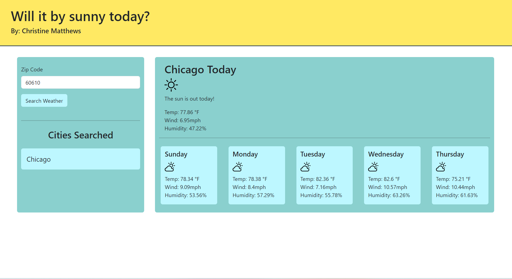
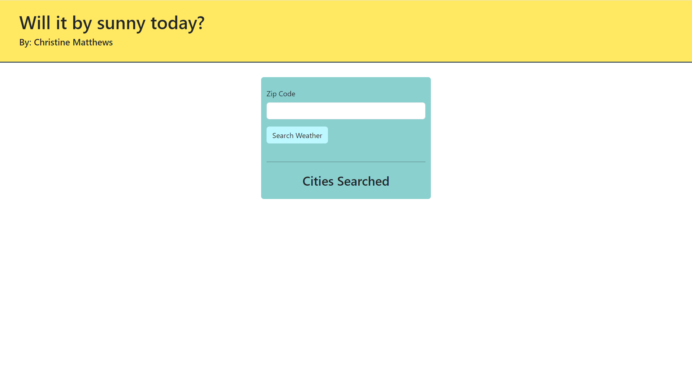

# Employee-Payroll-Tracker

## Description
This project is used to showcase my API skills in calling info from an API to display a weather app

## Installation
N/A

## Usage
To use this app, please search the city you'd like to see the weather by typing in your zip code for in the search form. After searching your city, you should be able to see the current, and future weather for that city. You will also see each city you search in the "cities searched" section where you can click on a previously searched city to see that data again. 

## Screenshot

## Link
<a href="https://cmatthews3212.github.io/Weather-App/">Weather App Website</a>

## Credits
- I was able to create this app using the info learned from class

## License
Please refer to the LICENSE in the repo.

## Badges
N/A

## Features
N/A
